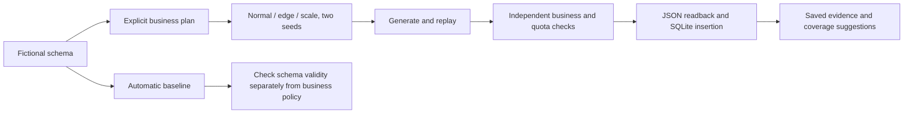

# Cross-domain pilot results

These are independently designed fictional engineering pilots, not customer trials
or validation against production schemas. Run them after installing DataLoom:

```sh
python -m pip install -e .
python examples/run_pilots.py
```

The runner needs no provider credentials, external database, Docker, or real data.
It creates a new ignored `.dataloom/demo/pilots-*` directory with JSON bundles,
plans, genomes, receipts, constrained SQLite databases, coverage history, and a
machine-readable `report.json`. It never overwrites previous runs.

## What was tested

For each of three schemas, run normal, edge, and modest scale scenarios at seeds
42 and 73: **18 explicit-plan runs**. Normal uses 12 root records and 2-4 children
per parent; edge allows zero children and raises optional-field NULL quotas from
10% to 30%; scale uses 200 root records with the same 2-4 fanout. These are small
functional pilots, not load or stress certification.

Every run independently checks business rules and exact quotas, compares both
records and receipts with a replay, reads exported JSON back, and inserts into
SQLite with foreign-key enforcement enabled. It checks database row counts and
`PRAGMA foreign_key_check` after insertion. The schemas include PK, UNIQUE, FK,
NOT NULL, and CHECK constraints. SQLite does not enforce PostgreSQL decimal/type
semantics identically; these pilots do not substitute for PostgreSQL integration.



## Observed results - September 22, 2026

DataLoom **0.1.0.dev4**, local Windows/Python 3.12 environment. All 18 explicit-plan
runs passed. **16,975 records** were generated across the runs, excluding replay
copies and automatic baselines. All replay comparisons and database FK checks
passed. The report includes per-run generation durations as diagnostics; it does
not measure peak memory, repeat timing trials, or establish throughput guarantees.

| Domain | Schema | Business policy checked | Records across six runs |
|---|---|---|---:|
| Commerce | Customers, orders, order lines | Quantity times price equals line total | 5,763 |
| Logistics | Warehouses, shipments, packages | Dispatch in 0-2 days, delivery 1-5 days later, weight times rate equals cost | 5,672 |
| Support | Accounts, tickets, replies | Urgency determines response target; overrun and breach agree with response time | 5,540 |

### Per-run row counts

| Domain | Scenario | Seed | Root / middle / child rows | Total |
|---|---|---:|---|---:|
| commerce | normal | 42 | 12 / 37 / 117 | 166 |
| commerce | normal | 73 | 12 / 37 / 109 | 158 |
| commerce | edge | 42 | 12 / 18 / 36 | 66 |
| commerce | edge | 73 | 12 / 22 / 32 | 66 |
| commerce | scale | 42 | 200 / 598 / 1825 | 2623 |
| commerce | scale | 73 | 200 / 619 / 1865 | 2684 |
| logistics | normal | 42 | 12 / 37 / 114 | 163 |
| logistics | normal | 73 | 12 / 38 / 119 | 169 |
| logistics | edge | 42 | 12 / 15 / 22 | 49 |
| logistics | edge | 73 | 12 / 19 / 30 | 61 |
| logistics | scale | 42 | 200 / 604 / 1813 | 2617 |
| logistics | scale | 73 | 200 / 598 / 1815 | 2613 |
| support | normal | 42 | 12 / 36 / 112 | 160 |
| support | normal | 73 | 12 / 35 / 101 | 148 |
| support | edge | 42 | 12 / 19 / 34 | 65 |
| support | edge | 73 | 12 / 20 / 29 | 61 |
| support | scale | 42 | 200 / 577 / 1724 | 2501 |
| support | scale | 73 | 200 / 610 / 1795 | 2605 |

## What schema-only generation did not infer

All three automatic baselines passed the engine's schema checks. Each failed an
independent business-policy assertion:

| Baseline | First observed business-policy mismatch |
|---|---|
| Commerce | Line total did not equal quantity times price |
| Logistics | Dispatch date fell outside the intended 0-2 day window |
| Support | Response target did not match urgency |

These policies were intentionally not fully encoded in SQL CHECK constraints.
DataLoom cannot discover unstated application rules. The explicit plans supplied
the missing arithmetic, date offsets, and conditional rules, and all corresponding
runs passed. `--auto` should be described as a structural starting point rather
than automatic discovery of business intent.

## Reusable inputs

- [Commerce schema](../examples/pilots/commerce.sql) and [plan](../examples/pilots/commerce.yaml).
- [Logistics schema](../examples/pilots/logistics.sql) and [plan](../examples/pilots/logistics.yaml).
- [Support schema](../examples/pilots/support.sql) and [plan](../examples/pilots/support.yaml).
- [Runner and independent assertions](../examples/run_pilots.py).

A plan can also be used through the ordinary CLI after introspection and
classification, with a new output directory:

```sh
dataloom introspect --ddl examples/pilots/commerce.sql
dataloom classify
dataloom generate --plan examples/pilots/commerce.yaml --output out/commerce-pilot
```

## Practical limits and next decisions

- Commerce checks line totals, not cross-row order aggregates, tax engines, or payments.
- Logistics checks same-row date windows and costs, not routes, real geography,
  business-day calendars, or package-weight aggregation into shipment weights.
- Support checks response-target arithmetic, not a full ticket state machine or
  timestamp-based operating-hours/SLA calendar.
- Names and locations are independent fictional samples; geographic consistency
  was not tested. The examples are reusable plans, not new installed domain packs.
- No live LLM, production data, customer system, or PostgreSQL connection was used
  in these pilot runs. There is no evidence of customer ROI or adoption here.

The next useful evaluation is a customer-provided, non-sensitive representative
schema with agreed application assertions. Candidate enhancements should be chosen
from gaps that evaluation exposes. Cross-row totals and business-calendar semantics
are particularly relevant follow-ups; these pilots do not implement either.
